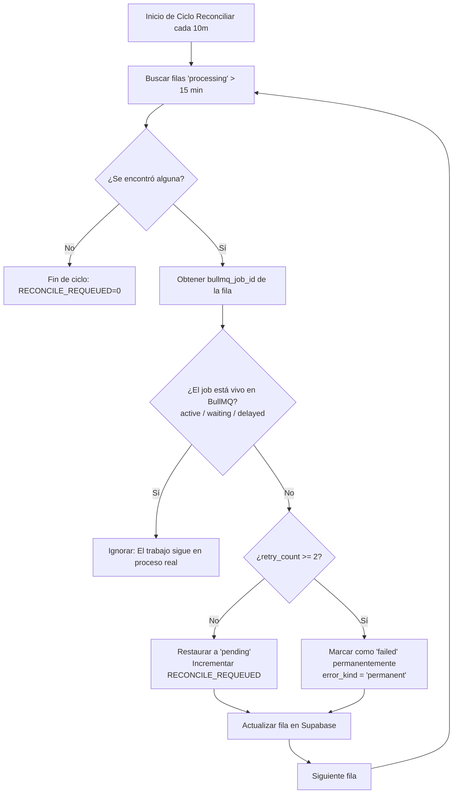

# Runbook de Operación en Producción — Black Box Magic Worker

Este documento detalla la matriz de resolución de incidentes, procedimientos de monitoreo y políticas de mitigación de costos para el pipeline y worker asíncrono BullMQ ejecutado en el VPS.

---

## 📋 Matriz de Resolución de Incidentes (Síntoma → Causa → Acción)

| Síntoma | Causa Probable | Acción Recomendada |
| :--- | :--- | :--- |
| **Error: Redis connection lost** o el worker no inicia y arroja errores de conexión a Redis. | El servidor Redis en el VPS está caído, no responde o se quedó sin memoria. | 1. Entrar vía SSH al VPS. 2. Comprobar el estado del servicio: `systemctl status redis` 3. Iniciar o reiniciar el servicio: `sudo systemctl restart redis` 4. Verificar que Redis escuche en el puerto correcto: `redis-cli ping` (debe responder `PONG`). 5. Si persiste, revisar los logs de Redis en `/var/log/redis/redis-server.log`. |
| **Alerta `[UBIQO_AUTH_FAILURE]` en logs** o filas de base de datos marcadas con `error_kind='ubiqo_auth'`. | El token de la API de Ubiqo ha expirado, ha sido revocado o es incorrecto. | **Procedimiento de Rotación de Token:** 1. Obtener un nuevo token válido de la consola de Ubiqo. 2. Actualizar el registro correspondiente en **1Password**. 3. Editar el archivo `.env` del worker en el VPS y actualizar la variable `UBIQO_API_TOKEN`. 4. Reiniciar el proceso de PM2 actualizando el entorno: `pm2 restart bbm-worker --update-env` |
| **Filas de capturas o incidencias estancadas** en estado `processing` por más de 15 minutos. | Caída abrupta del proceso del worker, reinicios del VPS o problemas severos de conectividad de red mientras se procesaba un lote. | **El Reconciliador de Estado Automático se encargará de esto:** 1. El worker ejecuta un repeatable job (`reconcile-jobs`) cada 10 minutos. 2. Este job consulta los IDs reales de BullMQ (`bullmq_job_id`) en Redis. 3. Si el job ya no está activo/esperando/retrasado en la cola, revierte automáticamente el estado de la fila a `pending` (para reintentar) o a `failed` (si ya superó los 2 intentos acumulados). 4. Busca en los logs del worker `RECONCILE_REQUEUED=<n>` para validar cuántos trabajos fueron recuperados. |
| **Mensaje `[Budget Exceeded]` en logs** y trabajos suspendidos en la cola o fallando de inmediato. | El costo estimado de procesamiento con Gemini de hoy ha superado el límite diario configurado en `GEMINI_DAILY_BUDGET_LIMIT`. | 1. Comprobar el costo acumulado en base de datos. Cada token consumido suma al total diario. 2. Si se requiere procesar más capturas de forma urgente, se puede incrementar temporalmente el límite diario en el archivo `.env` del VPS (ej: cambiar `GEMINI_DAILY_BUDGET_LIMIT=50.0` a `100.0`). 3. Reiniciar PM2 para aplicar el nuevo límite: `pm2 restart bbm-worker --update-env` *Nota: Si la variable está ausente, es inválida (no numérica) o es negativa, se aplica el fallback de seguridad de **$50 USD diarios**.* |

---

## 🔄 Flujo de Reconciliación de Estado (Cola ↔ Base de Datos)

El reconciliador de estado (`infra/vps/worker/src/reconcile.ts`) es una pieza de seguridad crítica diseñada para **evitar el bloqueo perpetuo** de capturas o incidencias.

### Monitoreo Manual de la Reconciliación
* Puedes ver el estado de la cola `reconcile` y del job repetible `reconcile-jobs` entrando al panel de **Bull Board** en `http://<IP-DEL-VPS>:3005/admin/queues`.
* Si deseas forzar un ciclo de reconciliación manual sin esperar los 10 minutos, puedes desencadenar el job directamente desde la sección "reconcile" en el panel visual.

---

## ⚡ Ajustes de Concurrencia y Rate Limits

Para regular el consumo y evitar bloqueos en Gemini, el worker respeta la configuración definida en las variables de entorno del VPS:

1. **`WORKER_CONCURRENCY`**: Define cuántos jobs se procesan en paralelo.
   * Por defecto, procesa un máximo de **2** capturas de Ubiqo concurrentes y **1** análisis de planograma concurrente.
   * Si el VPS tiene pocos recursos o Gemini arroja demasiados errores de límite de tasa, reduce la concurrencia a `1` en el archivo `.env`.
2. **`GEMINI_MAX_PER_MIN`**: Controla el rate limit de peticiones por minuto a la API de Gemini mediante el limitador nativo de BullMQ.
   * Por defecto es **30** peticiones por minuto.
   * Evita saturar la cuota gratuita o de pago de la API.
